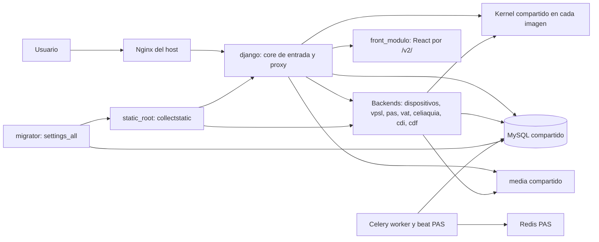

# Trabajar con verticales independientes

Guía vigente de #2638, contrastada con el código del 2026-10-05. Describe la
arquitectura implementada; las propuestas de #2641 no cambian estas reglas.
El ADR de [monorepo](../registro/decisiones/2026-09-30-monorepo-kernel-backends.md)
explica la separación y el de [estructura](../registro/decisiones/2026-10-02-estructura-src-backends.md)
reemplaza sus rutas. Para operar, ver [backends por servicio](../operacion/backends_por_servicio.md).

## Dónde va un archivo

| Dueño | Ubicación | Ejemplo y criterio |
| --- | --- | --- |
| Kernel | `src/backends/kernel/<app>/` | Identidad (`users`, `iam`), ciudadanos, organizaciones, catálogo de intervenciones, auditoría y utilidades comunes. Lo necesitan varios procesos y puede arrancar sin el core ni verticales. |
| Core de entrada | `src/backends/sisoc_core/<app>/` | Comedores/admisiones/rendiciones y servicios propios como dashboard, encuestas, PWA, usuarios y gestión de organizaciones. No confundir con la app técnica `src/backends/kernel/core/`. |
| Vertical | `src/backends/<vertical>/<app>/` | Regla, modelo, vista, template, estático o test de ese programa. CDI contiene centrodeinfancia y ticketera; CDF contiene centrodefamilia. |
| Runtime del vertical | `src/backends/<vertical>/<vertical>_runtime/` | Settings y URLconf que componen kernel + apps propias, sin core ni otros verticales. |
| Front React | `src/frontends/apps/<modulo>/` | Pantallas del módulo; paquetes comunes en `src/frontends/packages/`. |
| Tooling y scripts | `src/scripts/` | Automatización/operación; opciones base de TypeScript en `src/frontends/config/`, entradas autodetectables de herramientas en `src/frontends/` e imagen en `docker/frontends/`. |
| Configuración de composición | `src/backends/config/` | Registro de servicios, settings y URLs; no reglas de negocio. |

Antes de agregar algo, buscar su dueño y un patrón existente. Una regla de un
programa va en sus services; compartirla no basta para convertirla en kernel.
Ejemplos reales: `organizaciones` y `catalogo_intervenciones` son maestros
compartidos; `Firmante` está en `gestion_organizaciones` porque depende de
`comedores.Programas`. Una nueva responsabilidad del kernel necesita revisión
de arquitectura, no mover allí código para evitar una dependencia prohibida.

Los imports conservan los nombres Django (`import core`, `import pas`), no
usan `src.backends...`: `src/backends/config/__init__.py` arma las raíces del código
presente. Una FK permitida al kernel mantiene integridad en la DB compartida;
una FK, signal, SQL o import dinámico hacia otro servicio no evita el boundary.
No introducirlos como atajo. Registrar dueño, tablas, dependencias, permisos,
side effects y compatibilidad cuando el cambio cruza servicios.

Pasar el actor explícitamente a services para reglas y auditoría; thread-local
no es un contrato entre procesos. Cache de proceso solo como optimización,
no para locks, permisos o estado que otro servicio deba observar. Un signal
local no debe modificar tablas de otro dueño como integración oculta.

## Arquitectura en ejecución



Cada imagen contiene kernel + config + su dueño. El core recibe el tráfico y
aplica sus middleware antes del proxy. El backend usa la sesión y DB
compartidas, la misma clave de sesión y sus controles de permisos/CSRF; no
confiar en un ID de usuario recibido como sustituto de autorización.
`config.settings` carga el core; `<vertical>_runtime.settings`, el vertical;
`config.settings_all`, la composición completa para local, tests y migrador.
Esta separación no implica bases independientes ni aislamiento de CPU/RAM.
Un fallo de backend permite seguir usando rutas del core, pero una caída de
DB o un cambio incompatible de kernel puede afectar a todos.

## Reglas, motivo y control

Las rutas de esta sección son relativas a la raíz del repo. Los controles
citados existen; **revisión** indica que no hay un control automático general.

| Regla | Por qué | Control existente / límite |
| --- | --- | --- |
| Kernel no importa core ni verticales. | Debe arrancar dentro de cualquier imagen. | `.importlinter`, contrato `kernel-no-core-ni-backends` (excluye herramientas locales de diagnóstico); `src/backends/kernel/tests/test_kernel_arranca_solo.py`. |
| Un servicio no importa código de otro; dentro del mismo vertical puede haber varias apps. | El código ajeno no existe en su imagen. Un `api.py` Python público de otro servicio tampoco está disponible. | Contratos de boundaries en `.importlinter` y job `service_images` en `.github/workflows/tests.yml`. Import-linter no es un control universal de SQL, FKs por string ni imports dinámicos: revisión adicional. |
| Consumir datos remotos mediante contratos existentes, con permisos y fallback explícitos. | Mantiene el dueño del dato y evita imports de modelos ajenos. | `ciudadanos.detail_contributions` (HTML), `core.backend_proxy.pedir_json_a_backend` (JSON) y reenvío de favoritos; `src/backends/kernel/tests/test_backend_proxy.py`. Los tests de proxy no prueban una integración real autenticada. |
| Registrar prefijos de backend y regenerar nombres de URLs. | El proxy selecciona dueño por prefijo y cada runtime necesita poder hacer reverse de URLs ajenas. | `src/backends/config/backends.json`, `src/backends/config/url_registry.json`; `test_registro_de_urls_al_dia` en `src/backends/kernel/tests/test_servicios_backends.py`. Un nuevo path dentro de un prefijo existente no exige agregar otro prefijo. |
| Resolver archivos de app por `apps.get_app_config(...).path` o `__file__`. | `BASE_DIR` sigue siendo raíz operativa, no la carpeta de una app. | Revisión y test del flujo que usa el archivo en su runtime/imagen. El smoke de páginas no cubre cada DOCX, PDF o fixture. `BASE_DIR` sí sirve para `media`, `logs`, `static_root`. |
| Mover de carpeta conservando app label; mover de app conservando tabla y content type. | Evita recrear tablas y perder permisos o referencias de auditoría. | Migraciones de estado con `SeparateDatabaseAndState`; ejemplos de Firmante y catálogos abajo. `makemigrations --check --dry-run` detecta divergencia de estado, no prueba conservación de datos: verificar en DB aislada. |
| Usar migrador para el grafo completo y collectstatic. | Core/vertical no tienen todas las apps del historial; cargar su grafo puede dar `NodeNotFoundError`. | Perfil `migrate`, rol migrator en `docker/django/entrypoint.py`, `SISOC_PREPARAR_DB=false` en web; `service_images` verifica el estado de migraciones del migrador. Revisión de comandos operativos. |
| Esquema compatible con procesos temporalmente desfasados. | El deploy selectivo migra toda la DB y reinicia solo parte del stack; rollback de imagen no revierte datos. | Revisión de compatibilidad/migración/rollback y pruebas focalizadas; no hay test general que demuestre toda compatibilidad de versiones. |

No agregar excepciones de imports para pasar CI. Los contratos tienen listas
explícitas: al sumar una app, actualizar los source/forbidden modules que
correspondan. El job de imágenes complementa el lint porque el lint analiza
el checkout completo, donde el código ajeno sí está presente.

## Comandos y alcance de validación

Desde la raíz, en un entorno local **aislado y ya preparado**, los comandos
de desarrollo del repo usan `docker compose exec django`. No ejecutarlos
contra un stack compartido para probar cambios.

```bash
docker compose exec django pytest src/backends/kernel/tests/test_servicios_backends.py src/backends/kernel/tests/test_kernel_arranca_solo.py src/backends/kernel/tests/test_backend_proxy.py -v
docker compose exec -e DJANGO_SETTINGS_MODULE=config.settings_all django python manage.py generar_registro_urls
python src/scripts/ci/check_docs_paths.py
git diff --check
```

Para import-linter, reproducir el `PYTHONPATH` de
`.github/workflows/architecture.yml`, que incluye config, kernel y todos los
dueños; ejecutar `lint-imports` y `lint-imports --config .importlinter_celiaquia_config`.
`service_images` construye core, migrador y todos los backends y verifica
arranque y ausencia de apps ajenas. No reemplaza tests funcionales, MySQL
de migración ni aceptación manual. Si no se ejecuta, informarlo.

Para administración de deploy, usar la misma composición y variables del
entorno elegido; esta es la forma base (agregar el override de producción
si corresponde). Estos comandos afectan la DB configurada y requieren
autorización operativa, no forman parte de una validación documental:

```bash
docker compose --project-directory . -f docker/compose/docker-compose.deploy.yml --profile migrate run --rm migrator python manage.py showmigrations
docker compose --project-directory . -f docker/compose/docker-compose.deploy.yml --profile migrate run --rm migrator python manage.py createsuperuser
```

`migrate`, `makemigrations`, `showmigrations` y `createsuperuser` necesitan la
composición completa. En deploy, el rol migrator aplica migraciones, fixtures,
grupos, usuarios de prueba según configuración y `collectstatic`; web no
prepara DB. Revisar los efectos del entrypoint antes de ejecutar un one-off.

## Checklist 1: app en un vertical existente

- [ ] Confirmar que pertenece al mismo servicio y solo depende de su dueño/kernel.
- [ ] Crear la app en `src/backends/<vertical>/<app>/`, manteniendo labels existentes si se mueve; colocar recursos y tests junto al dueño.
- [ ] Agregarla a `apps` del vertical en `src/backends/config/backends.json`; no a `CORE_APPS`.
- [ ] Incluir URLs en el runtime y en la composición completa; ampliar `url_prefixes` solo si sale de los prefijos existentes.
- [ ] Actualizar contratos de imports para la app nueva y regenerar `url_registry.json` si cambia URLs.
- [ ] Verificar runtime aislado, permisos, recursos y tests del flujo, además de `service_images`; comprobar plan de deploy antes de incorporar.

Caso recorrido: `datacalle` dentro de dispositivos. Registro con dos apps,
runtime `dispositivos_runtime`, prefijos web/API y servicio único
`backend_dispositivos`. No requiere un segundo contenedor por app.

## Checklist 2: vertical nuevo

- [ ] Registrar dueño, tablas, dependencias kernel, permisos y contrato remoto; no asumir base propia ni introducir nueva infraestructura sin decisión.
- [ ] Crear carpeta y runtime; usar `config.backend_settings.aplicar` y `config.backend_urls.urlpatterns_de_backend`, como `cdf_runtime`.
- [ ] Declarar apps, prefijos, URLconf, origen y servicio en `backends.json`; sacar apps de `CORE_APPS` si se extraen del core.
- [ ] Ajustar composición completa (`settings_all`/`urls_all` según corresponda), `pytest.ini`, `.pylintrc` y contratos de imports. `src/backends/config/__init__.py` y architecture CI descubren carpetas; no mantienen una lista manual equivalente.
- [ ] Agregar servicio/imagen en `docker/compose/docker-compose.deploy.yml` y revisar overrides del entorno. PAS muestra cómo declarar `extra_services` para workers.
- [ ] Regenerar URLs; revisar rutas públicas/redirects compatibles, contribuciones y favoritos si los aporta.
- [ ] Correr tests de arranque/rutas y job `service_images` (itera el registro); probar plan de deploy selectivo y esquema compatible.

Caso recorrido: CDF extraído al backend `cdf`, con runtime, registro,
servicio y prefijos propios; redirects legacy en `core.legacy_redirects`.
Son compatibilidad para enlaces guardados, no rutas para código nuevo.

## Checklist 3: pantalla del core con datos de un vertical

- [ ] Elegir contrato existente: fragmento HTML para Ciudadano 360, JSON para métricas, reenvío para favoritos; no importar su `api.py` o modelos desde el core.
- [ ] Mantener consulta, autorización y template de fragmento en el dueño. Registrar contribución en `AppConfig.ready()` y `ciudadano_contributions` cuando es remota.
- [ ] Usar los helpers de `core.backend_proxy` para conservar contexto de sesión/headers; no crear llamadas internas sin controles.
- [ ] Definir qué muestra el core ante timeout, servicio caído, 403, datos vacíos o payload inválido; probar permitido/denegado y la degradación.
- [ ] Verificar la pantalla tanto con composición completa como con runtimes separados: el modo local puede ocultar un import indebido o falta de registro.

Caso recorrido: CDF registra `centrodefamilia` y `centrodefamilia_monto` en
`src/backends/cdf/centrodefamilia/apps.py` y en `backends.json`. Su fragmento se renderiza en
CDF; el kernel pide HTML con sesión y devuelve cadena vacía ante error/no 200.
El dashboard obtiene JSON de `/centrodefamilia/metricas-dashboard/` y hoy usa
ceros si no está disponible: esos ceros no demuestran ausencia de actividad.

## Checklist 4: mover un modelo de app

- [ ] Distinguir cambio de carpeta con mismo label (sin traslado de modelo en el estado) de cambio de app label (sí necesita migraciones).
- [ ] Identificar tabla, FKs, content type, permisos, referencias genéricas, admin, fixtures, imports y consumidores; registrar conteos/IDs antes en DB aislada.
- [ ] Crear el modelo en el estado destino y retirarlo del origen con `SeparateDatabaseAndState`, manteniendo `db_table` y sin operaciones SQL que creen/borren la tabla existente. Ordenar dependencias y estados de relaciones.
- [ ] Reasignar el content type existente conservando su PK; si ya existen origen y destino, detenerse y resolver explícitamente sin borrado automático.
- [ ] Probar instalación vacía y actualización desde estado previo en MySQL aislado: IDs, filas, relaciones, permisos/auditoría y `makemigrations --check --dry-run`.
- [ ] Definir compatibilidad con imágenes previas y reversa probada antes de incorporar; rollback de deploy no revierte la migración.

Caso recorrido: `src/backends/sisoc_core/gestion_organizaciones/migrations/0001_firmante_desde_organizaciones.py`
y `src/backends/kernel/organizaciones/migrations/0023_firmante_a_gestion.py`, bajo sus dueños
actuales. Conservan `organizaciones_firmante`; reasignan el content type y
fallan explícitamente si ambos labels existen. Catálogos usan el mismo patrón
en `src/backends/kernel/catalogo_intervenciones/migrations/0001_catalogos_desde_intervenciones.py`.
Este recorrido es documental; no equivale a haber repetido la migración en DB.

## Qué se despliega

La fuente ejecutable es `src/scripts/operacion/deploy_targets.py`; combinar archivos
acumula servicios hasta encontrar un cambio que exige **completo**.

| Archivos cambiados | Plan |
| --- | --- |
| Solo código/recursos en `src/backends/<vertical>/` registrado | Selectivo: backend + `extra_services`; migrador y collectstatic. |
| Solo `src/backends/sisoc_core/` | Selectivo: marcador `@core`, resuelto a servicios cuya imagen comienza con `sisoc/core:`; migrador. Si no se resuelven, fallback completo. |
| Kernel, config (incluido registro de URLs), requirements, docker/compose o `CHANGELOG.md` | Completo. Por eso agregar un prefijo suele convertir un cambio de vertical en completo. |
| Solo `src/frontends/apps/<modulo>/` | Selectivo: `front_<modulo>`, sin migrador. |
| Frontend compartido, configuración o lockfile dentro de `src/frontends/` | Selectivo: todos los fronts descubiertos, sin migrador. |
| Imagen/frontend en `docker/frontends/` o scripts de frontend en `src/scripts/frontends/` | Selectivo: todos los fronts, sin migrador. |
| Otros scripts en `src/scripts/` | Completo: fuera de las excepciones del selector, incluso si el script solo verifica documentación. |
| Solo `docs/`, `.github/`, `src/scripts/github/`, Markdown salvo CHANGELOG, benchmarks/baselines, `src/frontends/e2e/`, o tests directamente en `src/backends/<dueño>/tests/` | Ninguno. |
| Ruta no reconocida o SHA previo desconocido | Completo, por seguridad. |

No todos los tests se omiten: los ubicados dentro de una app (por ejemplo
`src/backends/celiaquia/celiaquia/tests/`) siguen la regla de su vertical.
Comprobar el conjunto real de archivos, no solo el nombre del PR:

```bash
python src/scripts/operacion/deploy_targets.py --files src/backends/pas/pas/tasks.py
python src/scripts/operacion/deploy_targets.py --files src/backends/sisoc_core/comedores/views.py
python src/scripts/operacion/deploy_targets.py --files docs/desarrollo/verticales_independientes.md
```

Antecedentes reales: #2637 agregó el selectivo del core; el cambio de estructura
#2639 (PR #2646) tocó código, kernel, config y Docker y requiere completo.
Modificar solo esta guía no despliega. El [plan de #2638](../plans/2026-T4/2026-10-05-issue-2638-documentacion-verticales.md)
registra los experimentos y el alcance de cada comprobación.

## Diagnóstico de errores frecuentes

| Síntoma | Primeras comprobaciones y límite |
| --- | --- |
| `NoReverseMatch` | Nombre, namespace y argumentos; luego registro generado con settings_all, `test_registro_de_urls_al_dia` y versión de imagen. No atribuir todo fallo a registro viejo. |
| Proxy 503 | Origen de `backends.json`/variable del entorno, servicio y red Compose, logs de backend y core. El proxy convierte error de conexión en 503; timeout en 504; también preserva errores HTTP del upstream. No publicar secretos al inspeccionar config/headers. |
| Sección vacía de ciudadano | Registro local en `ready()`, `ciudadano_contributions`, permisos, sesión, respuesta del endpoint de fragmento y warnings de contribución en logger `django`. Vacío puede ser falta de datos o degradación; probar con un usuario autorizado. |
| `service_images` rojo | Leer el paso fallido: build, `manage.py check`, aislamiento o estado de migraciones. Comparar apps instaladas/imports con contenido de imagen. Un test verde con settings_all no demuestra aislamiento. |
| Content types de origen y destino | Detener traslado, comparar PK/permisos/referencias y aplicar procedimiento aprobado en DB aislada primero. No usar `remove_stale_contenttypes` ni borrar duplicados a ciegas. |
| `NodeNotFoundError` en comando DB | Verificar settings y servicio: usar composición completa del migrador, sin alterar dependencias para hacer arrancar un runtime parcial. |
| Archivo no encontrado tras mover app | Buscar concatenaciones de BASE_DIR con nombres de app y resolver recurso por dueño. Probar el comando/ruta específica, no solo healthcheck. |

## Revisión de cambios que cruzan servicios

Usar los checklists anteriores en el PR: dueño, dependencia, rutas/registro,
sesión/permisos, degradación, esquema/rollback, servicios de deploy y evidencia
local/CI/manual diferenciada. No hace falta una skill adicional: ya existen
estos checklists y los controles de arquitectura. Una skill puede ser útil
si futuros cambios repiten pasos mecánicos; no introducir otro flujo obligatorio
sin un problema observado que estos controles no resuelvan.

## Vigencia de rutas documentadas

`python src/scripts/ci/check_docs_paths.py` detecta raíces movidas en código inline
y destinos de enlaces de los Markdown vigentes (incluye AGENTS, CLAUDE y README).
No interpreta texto libre, comandos en bloques, imports, URLs públicas ni
rutas de host; no es un validador universal de enlaces o de semántica.
Excluye `docs/registro/`, `docs/plans/`, `docs/analisis/` y `docs/infra/`
(snapshots históricos), las memorias validadas por commit en `docs/contexto/memoria/`
y documentos marcados explícitamente como históricos al comienzo.
Un literal relativo a una app se marca explícitamente
en su línea; no se hace pasar por ruta desde la raíz. Los ejemplos y comandos
de esta guía se revisan además contra archivos existentes y el plan de deploy.
